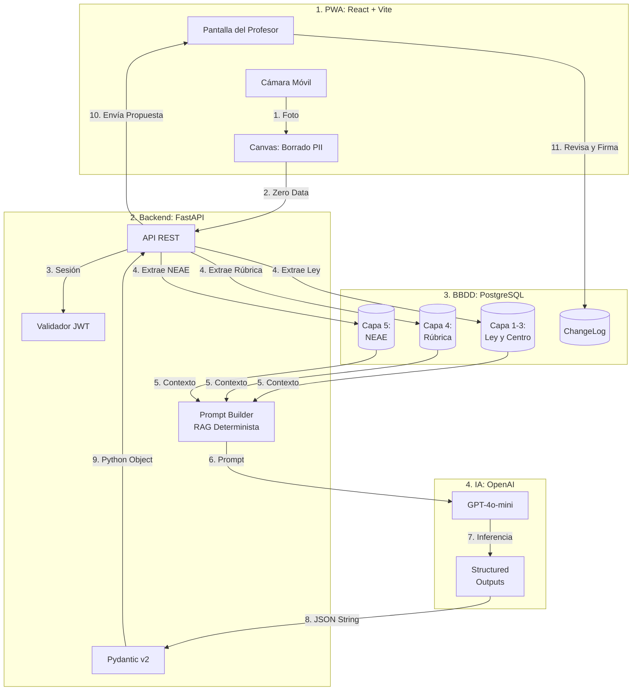

# api-correccion-formativa-ia-galicia 🎓⚡

[](https://fastapi.tiangolo.com/)
[](https://www.python.org/)
[](https://www.postgresql.org/)
[](https://openai.com/)
[](#)
[](#)

API de Corrección Formativa con IA diseñada para asistir al profesorado de cualquier materia de ESO y Bachillerato en la Comunidad Autónoma de Galicia (iniciando con Filosofía como módulo piloto). Estructurada bajo el marco pedagógico oficial de la LOMLOE, los Decretos 156/2022 y 157/2022 (Xunta de Galicia) (garantizando el blindaje estricto de la etapa educativa ESO/BACH), y las directrices de privacidad de la Unión Europea (RGPD / AI Act / ENS).


## 🌟 Propuesta de Valor Diferencial

*   **Alineamiento Curricular Gallego:** Capacidad de integrar de forma paramétrica las competencias clave, específicas y criterios de evaluación de cualquier materia de ESO y Bachillerato definidos por la Xunta de Galicia (`[D-027] Modo Dual de Rúbrica`).
*   **Deslinde Formativo vs Sumativo (HitL):** El sistema no califica de forma fría ni automática; realiza un desglose cualitativo por rúbricas pedagógicas, devuelve un **Siguiente Paso Accionable (Feed Forward)** y un **Índice de Confianza IA** para evitar alucinaciones. El docente siempre conserva la soberanía y firma la nota (`[D-002]`).
*   **AI Safety & Guardrails:** Arquitectura multinivel (*Multilayered Guardrails*) para prevenir alucinaciones mediante contratos JSON estrictos (`Pydantic`), reglas de exclusión NEAE y ofuscación de PII. Transforma el LLM probabilístico en un evaluador determinista (`[D-063]`).
*   **Blindaje de Privacidad y Seguridad (Stealth/Phase Ninja):** Seudonimización estricta del alumnado en la nube (`alumno_id = "A-14"`) sin cifrado de columnas frágil (`[D-031]`). La libreta de equivalencia con la identidad real del menor reside en exclusiva en el cuaderno local de la profesora, y la autenticación docente se resguarda con hacheo unidireccional irreversible `bcrypt` + sesiones `JWT`.
*   **Zero Data Retention (Client-Side Redaction):** Antes de enviar ninguna fotografía al backend, la aplicación web progresiva (PWA) permite censurar los nombres manuscritos directamente en el navegador del docente usando la Canvas API (`[D-034]`). Los píxeles originales se destruyen en la memoria RAM local; la PII jamás viaja por la red ni toca los servidores de IA.
*   **Resiliencia y Optimización FinOps:** Unificación del motor en OpenAI (`gpt-4o-mini`) para texto y visión (`[D-053]`), garantizando *Structured Outputs* nativos para el 100% de cumplimiento del esquema `EvaluacionIA` tras la deprecación de los modelos compatibles en Groq. La cualitativa ESO se asigna de forma determinista en el backend (`[D-052]`), sin depender del criterio del LLM.

---

## 🏗️ Arquitectura y Flujo de Ejecución



---

## 🛠️ Instalación y Ejecución Local (WSL / Ubuntu)

### Prerrequisitos

*   Python 3.12 o superior (probado en Python 3.14 en entorno WSL)
*   Docker y Docker Compose (para el contenedor transaccional de PostgreSQL 16 Alpine)
*   Entorno Linux / WSL (Windows Subsystem for Linux)

### 1. Desplegar la Base de Datos Relacional en Docker

El sistema utiliza un contenedor PostgreSQL aislado expuesto en el **Puerto Dedicado 5433** (`[D-030]`) para evitar colisiones nativas con bases de datos locales:

```bash
docker compose up -d
```

### 2. Clonar e inicializar el entorno virtual Python

```bash
python3 -m venv venv
source venv/bin/activate

pip install -r requirements.txt
```

### 3. Configurar variables de entorno

```bash
cp .env.example .env
```

Abre `.env` y configura tus API Keys reales de Groq/OpenAI, la cadena `DATABASE_URL` y tu `SECRET_KEY` transaccional para los tokens Bearer.

> ⚠️ **IMPORTANTE — SECRET_KEY:** El servidor valida en el arranque que esta variable contenga un valor personalizado y único. Si se deja el valor por defecto del `.env.example`, el proceso abortará con error crítico. Genera una clave segura con:
> ```bash
> openssl rand -hex 32
> ```

### 4. Ejecutar las Migraciones Transaccionales de Alembic

```bash
alembic upgrade head
```

> ⚠️ **Nota de deuda técnica:** Las migraciones se aplican correctamente en desarrollo, pero la suite de tests actual valida contra SQLite en memoria (`metadata.create_all()`), no contra un contenedor Postgres real con `alembic upgrade head`. Ver [AUDITORIA.md](./AUDITORIA.md), sección 4, fila "Alembic".

### 5. Ejecutar el Servidor FastAPI

```bash
uvicorn backend.main:app --reload --host 127.0.0.1 --port 8000
```

El servidor estará accesible en `http://127.0.0.1:8000`. Puedes consultar la documentación interactiva Swagger UI en `http://127.0.0.1:8000/docs`.

### 6. Ejecutar la Suite de Pruebas (Backend)

```bash
venv/bin/pytest backend/tests/ -v
```

### 7. Ejecutar el Frontend (React PWA - v0.5)

La interfaz gráfica del profesor está desarrollada en React + Vite y se ejecuta de forma independiente. Incorpora HTTPS local para poder usar la cámara desde el móvil en la misma red Wi-Fi (`[D-058]`). Cuenta con un componente crítico de **Zero Data Retention** (`CameraCapture.jsx`): permite recortar y tachar manualmente el nombre del alumno en el propio navegador, destruyendo los píxeles antes de enviarlos a la nube.

```bash
cd frontend
npm install
npm run dev -- --host
```

La interfaz estará disponible en `https://localhost:5173`. Para testear los componentes visuales:
```bash
npx vitest run
```

---

## 📡 API Endpoints

### Implementados

| Endpoint | Verbo | Auth | Descripción |
| :--- | :---: | :---: | :--- |
| `/health` | `GET` | 🔓 Pública | Estado del servidor |
| `/api/v1/auth/register` | `POST` | 🔓 Pública | Registro de profesora |
| `/api/v1/auth/login` | `POST` | 🔓 Pública | Login → devuelve JWT Bearer |
| `/api/v1/auth/login-json` | `POST` | 🔓 Pública | Login en JSON (compatible Swagger) |
| `/api/v1/auth/me` | `GET` | 🔒 JWT | Verificar sesión activa |
| `/api/v1/marcos` | `GET` | 🔒 JWT | Listar marcos normativos (Xunta) |
| `/api/v1/rubricas` | `POST / GET` | 🔒 JWT | Crear y listar rúbricas del docente |
| `/api/v1/evaluate` | `POST` | 🔒 JWT | Corrección formativa con IA (`REVIEW`) |
| `/api/v1/evaluaciones/{id}/approve` | `PATCH` | 🔒 JWT | Aprobación HitL docente (`REVIEW → GRADED`), `[v0.2-009]` |
| `/api/v1/submissions` | `GET` | 🔒 JWT | Lista de entregas del profesor autenticado, `[v0.2-010]` |
| `/api/v1/evaluaciones/{submission_id}` | `GET` | 🔒 JWT | Detalle evaluativo estructurado (`EvaluacionIA`), `[v0.2-010]` |
| `/api/v1/submissions/{id}/feed-forward/realizado` | `PATCH` | 🔒 JWT | Transición formativa a `REALIZADO_ALUMNO`, `[D-026]` |
| `/api/v1/submissions/{id}/feed-forward/verificado` | `PATCH` | 🔒 JWT | Transición formativa a `VERIFICADO_EN_PRUEBA_SIGUIENTE`, `[D-026]` |
| `/api/v1/submissions/upload` | `POST` | 🔒 JWT | Subida de imagen/PDF del examen (multipart), `[v0.3-001]` |
| `/api/v1/submissions/upload-and-evaluate` | `POST` | 🔒 JWT | Pipeline asíncrono unificado (`202 Accepted` + `BackgroundTasks`), `[v0.4-002]`, `[D-055]` |


### Próximos (Roadmap)

| Endpoint | Verbo | Versión | Descripción |
| :--- | :---: | :---: | :--- |
| `/api/v1/submissions/{id}/events` | `GET SSE` | 🔜 v0.6 | Notificación en tiempo real al finalizar corrección |
| `/api/v1/submissions/{id}/changelog` | `GET` | 🔜 v1.0 | Historial inmutable de auditoría AI Act |

> ✅ **Pipeline Multimodal validado (12/08/2026):** El motor de visión (`gpt-4o-mini` vía OpenAI *Structured Outputs*) ha sido verificado mediante pruebas de integración aisladas, devolviendo el contrato `EvaluacionIA` completo y sin errores. La asignación de la cualitativa ESO es determinista en el backend. Ver [`[D-051]`](decisiones.md#d-051) y [`[D-052]`](decisiones.md#d-052).

> La documentación interactiva completa (Swagger UI) está disponible en `http://127.0.0.1:8000/docs` al ejecutar el servidor en local.

---

## 🔒 Autenticación y Seguridad: Endpoints `/api/v1/auth/*` (`[v0.2-002]`)

El backend incorpora autenticación transaccional por token Bearer, separando el registro docente del login y la validación de sesión.

### 1. Registro Docente: POST `/api/v1/auth/register`

Registra una nueva cuenta de profesora en la tabla `profesores`. La contraseña se hachea matemáticamente con `bcrypt` y jamás se almacena en texto claro ni se devuelve en las respuestas.

```bash
curl -X POST http://127.0.0.1:8000/api/v1/auth/register \
  -H "Content-Type: application/json" \
  -d '{
    "email": "alba.camina@edu.xunta.gal",
    "nombre": "Alba Camiña García",
    "password": "PasswordSeguroGalicia2026"
  }'
```

### 2. Inicio de Sesión (Obtener JWT): POST `/api/v1/auth/login`

Acepta tanto **OAuth2 Form Data** nativo de FastAPI (compatible con el candado de Swagger UI `/docs`) como cargas JSON en `/api/v1/auth/login-json`. Devuelve el Bearer Token JWT.

```bash
curl -X POST http://127.0.0.1:8000/api/v1/auth/login-json \
  -H "Content-Type: application/json" \
  -d '{
    "email": "alba.camina@edu.xunta.gal",
    "password": "PasswordSeguroGalicia2026"
  }'
```

### 3. Verificar Sesión Activa: GET `/api/v1/auth/me`

Ruta protegida que valida la cabecera `Authorization: Bearer <token>`.

```bash
curl -X GET http://127.0.0.1:8000/api/v1/auth/me \
  -H "Authorization: Bearer <TU_TOKEN_JWT_AQUI>"
```

---

## 📚 Marco Normativo Gallego: GET `/api/v1/marcos` (`[v0.2-003]`)

Devuelve los marcos de evaluación oficiales cargados en la base de datos (Decretos 156/157/2022 de la Xunta de Galicia). El motor de corrección usa estos marcos para evaluar competencias según la legislación vigente (`modo_evaluacion: COMBINADO` o `AUDITORIA_CURRICULAR`).

```bash
curl -X GET http://127.0.0.1:8000/api/v1/marcos \
  -H "Authorization: Bearer <TU_TOKEN_JWT_AQUI>"
```

Respuesta de ejemplo:

```json
[
  {
    "id": 1,
    "nombre": "Filosofía de Bachillerato — Galicia",
    "asignatura": "Filosofía",
    "curso": "1º Bachillerato",
    "etapa": "BACH",
    "estado_activo": true,
    "normativa_fuentes": [
      {
        "tipo": "Decreto",
        "numero": "157/2022",
        "fecha": "2022-08-04",
        "url": "https://www.xunta.gal/dog/Publicados/2022/20220804/AnuncioG0655-280722-0001_es.html",
        "vigente_desde": "2022-09-01",
        "vigente_hasta": null
      }
    ],
    "ultima_verificacion_manual": "2026-07-14"
  }
]
```

---

## 📋 Rúbricas del Docente: POST / GET `/api/v1/rubricas` (`[v0.2-004]`)

Permite al docente crear y recuperar sus rúbricas de corrección personalizadas. Una rúbrica pertenece exclusivamente a la profesora que la creó — ningún otro docente puede acceder ni modificarla.

### Crear una rúbrica: POST `/api/v1/rubricas`

```bash
curl -X POST http://127.0.0.1:8000/api/v1/rubricas \
  -H "Authorization: Bearer <TU_TOKEN_JWT_AQUI>" \
  -H "Content-Type: application/json" \
  -d '{
    "nombre": "Rúbrica Alegoría de la Caverna",
    "criterios": {
      "precision_conceptual": {"peso": 0.5, "descripcion": "Identifica correctamente el simbolismo platónico"},
      "argumentacion": {"peso": 0.3, "descripcion": "Justifica con coherencia filosófica"},
      "expresion_escrita": {"peso": 0.2, "descripcion": "Claridad y estructura del texto"}
    }
  }'
```

### Listar mis rúbricas: GET `/api/v1/rubricas`

```bash
curl -X GET http://127.0.0.1:8000/api/v1/rubricas \
  -H "Authorization: Bearer <TU_TOKEN_JWT_AQUI>"
```

---

## 📡 Corrección Formativa con IA: POST `/api/v1/evaluate` (`[v0.2-004]` – `[v0.2-007]`)

Endpoint protegido por **Token Bearer JWT** conectado a base de datos PostgreSQL. Valida la pertenencia de la rúbrica al docente que realiza la petición (`[v0.2-004]`), inyecta el marco normativo gallego si se solicita (`modo_evaluacion`), aplica las instrucciones de exclusión pedagógica para adaptaciones NEAE/NEE (Decreto 229/2011) (`[v0.2-007]`), y registra la entrega y la evaluación de forma inmutable (`submissions`, `evaluaciones`, `changelog`).

### Ejemplo de Petición (Request)

> ⚠️ **BREAKING CHANGE (D-041):** El campo `etapa` ("ESO" | "BACH") es obligatorio en el payload. Sin él la API devuelve `422 Unprocessable Entity`, y si su valor contradice la etapa del marco normativo seleccionado devuelve `400 Bad Request`.

Requiere cabecera de autenticación `Authorization: Bearer <token>`:

```bash
curl -X POST http://127.0.0.1:8000/api/v1/evaluate \
  -H "Authorization: Bearer <TU_TOKEN_JWT_AQUI>" \
  -H "Content-Type: application/json" \
  -d '{
    "student_answer": "El prisionero sale de la caverna y ve el sol o la luz...",
    "rubrica_id": 1,
    "marco_id": 1,
    "etapa": "BACH",
    "modo_evaluacion": "COMBINADO",
    "question": "¿Qué simboliza la salida del prisionero de la caverna?",
    "alumno_id": "A-14",
    "adaptaciones_alumno": {
      "tipo": ["dislexia"],
      "excluir_ortografia": true,
      "tiempo_extra_pct": 35
    }
  }'
```

### Ejemplo de Respuesta (Response: `EvaluacionResponse`)

El servidor guarda la entrega en PostgreSQL y devuelve la evaluación estructurada con marcadores visuales neut (`type: "error_excluido"`) y registro de ortografía excluida por adaptación.

> ⚠️ **Nota sobre la escala cualitativa (`D-042`, `D-049`):** La escala cualitativa oficial (`IN`, `SU`, `BE`, `NT`, `SB`) aplica **solo en ESO** (Decreto 156/2022). En Bachillerato no existe escala cualitativa oficial en el expediente — el campo `calificacion_cualitativa` es `null` (`D-049`). Nunca `"BI"` ni `"NA"`.

```json
{
  "submission_id": "8905b4e7-91f8-4cb2-a723-8c43919e1e23",
  "evaluacion_id": "f47ac10b-58cc-4372-a567-0e02b2c3d479",
  "estado": "REVIEW",
  "resultado_ia": {
    "transcription": "El prisionero sale de la caverna y ve el sol o la luz...",
    "rubricBreakdown": [
      {
        "category": "Precisión conceptual y simbolismo platónico",
        "score": 4.0,
        "maxScore": 5.0,
        "reasoning": "El estudiante identifica correctamente el Sol y el exterior como símbolos platónicos. Se valora el contenido sin penalizar ortografía según adaptación."
      }
    ],
    "visualMarkers": [
      {
        "x": 12.5,
        "y": 45.0,
        "type": "error_excluido",
        "comment": "Error ortográfico detectado pero NO penalizado (Adaptación Dislexia activa)."
      }
    ],
    "qualitativeAnalysis": {
      "strengths": [
        "Comprende la alegoría y su relación con la luz inteligible."
      ],
      "improvementNeeds": {
        "immediate": [
          "Vincular el papel del filósofo con el retorno a la caverna."
        ],
        "mediumLongTerm": [
          "Relacionar el mito con el dualismo epistemológico platónico."
        ]
      },
      "teacherSummary": "Excelente base conceptual adaptada al perfil NEAE del alumno."
    },
    "calificacion_numerica": 8.0,
    "calificacion_cualitativa": null,
    "siguiente_paso_accionable": "Explica en un párrafo por qué el prisionero liberado debe regresar con sus compañeros en la oscuridad.",
    "confidence_score": 0.95,
    "ortografia_detectada": true,
    "errores_excluidos_por_adaptacion": [
      "Falta de tilde en término aislado (excluido por dislexia)."
    ]
  }
}
```

---

## 🎯 Seguimiento Formativo y Auditoría (Feed Forward + HitL) (`[D-026]`)

El backend gestiona el seguimiento formativo del **Siguiente Paso Accionable (`estado_feed_forward`)** de forma independiente a la calificación sumativa del examen (`[D-026]`). El ciclo de vida formativo avanza de manera estrictamente unidireccional: `PENDIENTE` → `REALIZADO_ALUMNO` → `VERIFICADO_EN_PRUEBA_SIGUIENTE`. Cualquier intento de salto no permitido devuelve `409 Conflict`.

### Endpoints de Transición Formativa

| Endpoint transicional | Método | Auth | Descripción |
| :--- | :---: | :---: | :--- |
| `/api/v1/submissions/{id}/feed-forward/realizado` | `PATCH` | ✅ JWT | Marca que el estudiante ha completado su acción de mejora (`REALIZADO_ALUMNO`). |
| `/api/v1/submissions/{id}/feed-forward/verificado` | `PATCH` | ✅ JWT | Confirma que la mejora se ha comprobado en la siguiente evaluación (`VERIFICADO_EN_PRUEBA_SIGUIENTE`). |

### Trazabilidad y Cumplimiento (`[D-002]`)

1. **El motor LLM no persiste nunca el estado formativo:** Aunque la IA devuelva en su evaluación recomendaciones de verificación (`feed_forward_verification_suggestion`), la actualización en BBDD requiere confirmación humana explícita a través de los endpoints transicionales.
2. **Auditoría estructurada en `ChangeLog`:** Cada transición persiste un registro atómico inmutable que separa el cambio de estado (`datos_anteriores` / `datos_nuevos`) del contexto de auditoría (`audit_metadata`, donde se traza si la IA recomendó el cambio y el ID de evaluación vinculada). El `actor` registrado en la base de datos es siempre el profesor autenticado (`PROFESOR_ID_X`).

---

## 🧠 AI-Augmented Engineering & Declaración de Transparencia (AI Act)

Este proyecto aplica una rigurosa metodología de ingeniería acelerada mediante Inteligencia Artificial, operando siempre bajo un marco de estricta gobernanza (*Human-in-the-Loop*). En cumplimiento con los estándares de transparencia algorítmica y el **Art. 50 de la AI Act de la UE**, se declara lo siguiente:

### 1. Gobernanza de Código (Orquestación de Agentes)
El desarrollo técnico ha sido acelerado utilizando herramientas de *Agentic Coding* (orquestación de agentes autónomos). Sin embargo, la IA en este repositorio no opera libremente; está constreñida por un marco normativo estricto inyectado en su sistema (`AGENTS.md`), que obliga a cumplir:
*   **Soberanía Arquitectónica:** El diseño del sistema, las reglas de negocio (LOMLOE) y la seguridad de los datos (Zero Data Retention) son 100% de autoría humana.
*   **Freno Conductual (*Stop & Consult*):** La IA tiene terminantemente prohibido parchear el sistema estructuralmente sin autorización explícita. Ante un cruce de caminos arquitectónico, debe detenerse y presentar opciones.
*   **PonyTail Coding (YAGNI):** La IA está bloqueada de realizar abstracciones prematuras o incluir dependencias redundantes.

### 2. Implementación Histórica y Validación (*Fase Ninja*)

1.  **Qué diseñé yo (Soberanía Arquitectónica y Prompting):** Diseñé el modelo pedagógico de evaluación educativa mediante Pydantic v2 (`EvaluacionIA`), estructuré el flujo del backend en FastAPI y definí el **Protocolo de Pausa Arquitectónica (*Stop & Consult*)** y el **Freno Conductual** (`Regla 5 de AGENTS.md`) que prohíbe ediciones no autorizadas. Asimismo, dirigí las decisiones de diseño arquitectónico (ADRs `[D-030]` y `[D-031]`), imponiendo la **Seudonimización Estricta (`alumno_id=A-14`)** para los menores en lugar de cifrados de columna con claves maestras frágiles en `.env`, blindando el sistema ante pérdidas catastróficas de datos y garantizando el cumplimiento normativo del **ENS y RGPD**.
2.  **Qué ejecutaron los agentes (Generación de Código e Infraestructura):** El agente orquestado por IA generó los esquemas ORM y Pydantic agrupados en **Modularidad Plana (`backend/models/user.py`)** bajo el principio YAGNI con su respectivo *Scaling Trigger* documentado para el umbral de 8-10 tablas. Además, el agente configuró el contenedor Docker de PostgreSQL en el puerto exclusivo **`5433:5432`**, gestionó las dependencias de seguridad (`passlib[bcrypt]`, `pyjwt`, `pydantic[email]`) y generó de forma automática los scripts de versionado de esquema en `Alembic`.
3. **Cómo validé yo (Pruebas Unitarias, Terminal y Auditoría por Pares IA):** Validé el comportamiento transaccional ejecutando yo misma en consola WSL la activación de entornos virtuales (`source venv/bin/activate`), la aplicación de migraciones relacionales (`alembic upgrade head`) y los flujos de control de versiones con Git en *Modo Copiloto*. Para certificar el máximo nivel de excelencia y seguridad sin sesgos, sometí la arquitectura de autenticación e invariantes de Pydantic a una **Auditoría de Pares Multi-Motor (`Multi-Agent Peer Review` por Token Multiplexing en Perplexity Pro / ChatGPT / Claude)**, obteniendo una calificación unánime de **10/10 en seguridad práctica sin sobreingeniería**.
4.  **Qué aprendí (Lecciones de FinOps y Gobernanza):** Aprendí que la verdadera maestría en el desarrollo asistido por IA no consiste en dejar que el modelo genere código abstracto sin control, sino en ejercer la dirección técnica mediante protocolos de pausa y revisión por pares entre distintos motores LLM. La modularidad plana combinada con hacheo unidireccional y seudonimización elimina por completo la deuda técnica de la criptografía ad-hoc, logrando un portfolio 100% autoinstalable, auditable y conforme a la ley gallega y europea.

---

## 🛡️ Patrón Showcase y Propiedad Intelectual

Este repositorio sigue el patrón de diseño **Open Core / Showcase**. La infraestructura, seguridad, base de datos y gobernanza arquitectónica son públicas para permitir la auditoría técnica. Sin embargo, para proteger el núcleo del modelo de negocio, **los siguientes módulos han sido excluidos del control de versiones público**:
*   Ingeniería de Prompts (`prompt_builder.py`).
*   Esquemas de validación de OpenAI *Structured Outputs* (`evaluation.py`).
*   Modelos de datos pedagógicos y Mocks de prueba (`seed_db.py`, `llm_client.py`).

El sistema en producción carga estos módulos desde submódulos privados y repositorios aislados.

---

## ⚖️ Licencia y Condiciones de Uso

**Copyright © 2026 Alba Camiña García. Todos los derechos reservados.**

Este repositorio se expone de forma pública de manera intencionada como parte de una estrategia **Build in Public**, con el objetivo de demostrar la arquitectura técnica, someter el código a auditorías de seguridad y conformar un portfolio profesional. 

Sin embargo, el código **NO es de libre uso ni de código abierto (Open Source)**. Queda estrictamente prohibida su copia, modificación, distribución o comercialización (incluyendo el despliegue como modelo SaaS, uso en entornos de producción o integración en plataformas EdTech de terceros) sin autorización previa, expresa y por escrito. Para más detalles, consulta el archivo [LICENSE](./LICENSE).

### Cuarentena de Dependencias y Contribuciones (CLA)
Para garantizar la viabilidad comercial del producto, este proyecto opera bajo una estricta política de **Zero-GPL** (`[D-061]`). Cualquier dependencia de terceros debe contar con una licencia permisiva (MIT, Apache 2.0, BSD). 
Si deseas colaborar (reportar fallos o proponer código), ten en cuenta que operamos con un **Acuerdo de Licencia de Colaborador (CLA)** que exige la cesión irrevocable de los derechos comerciales a favor del autor original. Revisa el archivo [CONTRIBUTING.md](./CONTRIBUTING.md) antes de abrir un *Pull Request*.
